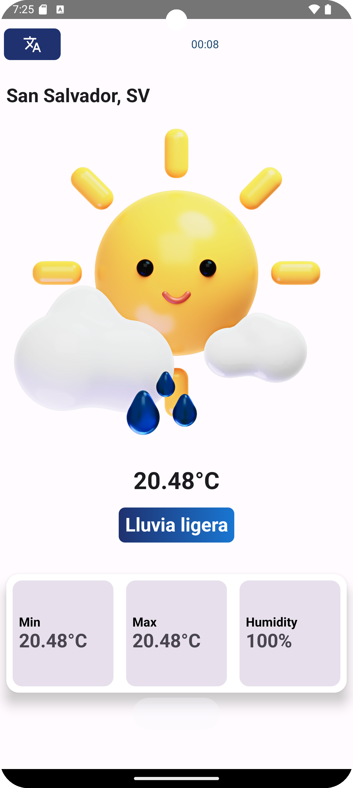

# WeatherApp 🌧️

WeatherApp es una aplicación móvil desarrollada con Jetpack Compose que muestra información meteorológica en tiempo real.

## Características

- Muestra la temperatura actual, mínima y máxima.
- Indica el grado de humedad.
- Presenta un icono que representa el estado del clima actual (soleado, nublado, lluvioso, etc.).
- Permite cambiar entre español e inglés.

## Requisitos del Sistema

- Android Studio Arctic Fox (o una versión posterior)
- JDK 11 o superior
- Gradle 7.0 o superior

## Instrucciones de Instalación

1. Clona el repositorio en tu máquina local:

```bash
git clone https://github.com/marvnramos/WeatherApp.git
```

2. Abre el proyecto en Android Studio.

3. Abre build.gradle.kts y asegurate de establecer tus credenciales
```kts
buildConfigField("String", "API_KEY", "\"98sdf9sdf7sd9f980sdfexample1\"")
buildConfigField("String", "API_BASE_URL", "\"https://api.example/v1/\"")
```

6. Sincroniza el proyecto con Gradle.

7. Asegúrate de tener un dispositivo Android o un emulador configurado.

8. Construye y ejecuta la aplicación.

## Uso de la Aplicación

1. Al iniciar la aplicación, verás una pantalla con información meteorológica.

2. La aplicación mostrará la temperatura actual, mínima y máxima, así como el grado de humedad.

3. Un icono representará el estado actual del clima (soleado, nublado, lluvioso, etc.).

4. En la parte superior de la pantalla, encontrarás un botón para cambiar entre español e inglés.

5. Además de actualizar su información automáticamente cada 10s. 

## Anexos

Video ilustrativo: [Clic aquí ✨](https://ufgedu-my.sharepoint.com/:v:/g/personal/ia_marvind_ufg_edu_sv/EQXX5eUazmdGrk8YwYk3sFgBVD2Xvs0j64Suq9YNeYZ3ig?nav=eyJyZWZlcnJhbEluZm8iOnsicmVmZXJyYWxBcHAiOiJPbmVEcml2ZUZvckJ1c2luZXNzIiwicmVmZXJyYWxBcHBQbGF0Zm9ybSI6IldlYiIsInJlZmVycmFsTW9kZSI6InZpZXciLCJyZWZlcnJhbFZpZXciOiJNeUZpbGVzTGlua0NvcHkifX0&e=WKUMpu)




¡Disfruta usando WeatherApp!

Citations:
[1] https://github.com/marvnramos/WeatherApp.git
